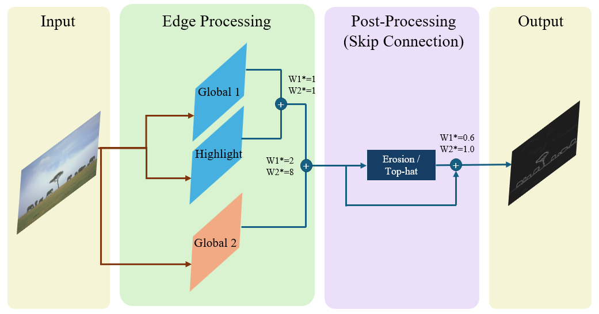

# 24-CV-BoundaryDetection
This repository contains code for **24-Fall Computer Vision Boundary Detection project**. The project dataset is designed to facilitate training and testing of a boundary. 
  
## Pipeline Overview
This is the pipeline we used for our model:
<div style="text-align: center;">

</div> 

## Requirements
Clone this repository:
```
git clone https://github.com/finallyupper/24-CV-BoundaryDetection.git
```
Then install the requirements in your virtual environments. And place the given train and test dataset into `project_data/train` and `project_data/test`.


## Quick Start
To get started with predictions, follow these steps:
1. Open the `main.ipynb` notebook.
2. The notebook demonstrates how to:
    - Load the dataset.
    - Apply filters.
    - Generate predictions using the pipeline.
3. To use a custom combination of filters, modify the total_filter function:

    ```
    def total_filter(images, b1=75, b2=200, limit=60, iter=0):
        f1 = global_filter_1(images, iter=iter)
        f2 = global_filter_2(images)
        f3 = highlight_filter(images, b1, b2, limit)

        f1_f3_norm = get_overlap_lst(f1, f3, "add")
        
        f1f3_conventional = get_overlap_lst(f1_f3_norm, f2, "add", w1=2, w2=8)
        f1f3_conventional_norm = normalize_image(f1f3_conventional)
        
        tophat_out_norm = morph_processor(f1f3_conventional_norm)

        pred_edges = skip_connection(f1f3_conventional_norm, tophat_out_norm)
        return pred_edges 

    ```
## File Structure
- `engine/*`: Utility functions for dataset loading, normalization, and saving outputs as `.npy` files.
- `filters.py`: Traditional edge detection filters (e.g., Sobel, Canny).
- `custom_filters.py`: Five core pipeline components: `global filter 1`, `global filter 2`, `highlight filter`, `morphological processor`, and `skip connection`.
- `evaluate.py`: Tools for evaluation and saving predictions as logs or `.npy` files. (Our prediction file can be downloaded on `./preds/1206_new2_f1sobel_l60_i0_train.npy`).

## Dataset
detection model:
- Annotations: Each image is annotated by three independent annotators.
- Boundary Pixel: 1
- Background Pixel: 0
- Training Set: 200 images (train.zip)
- Test Set: 100 images